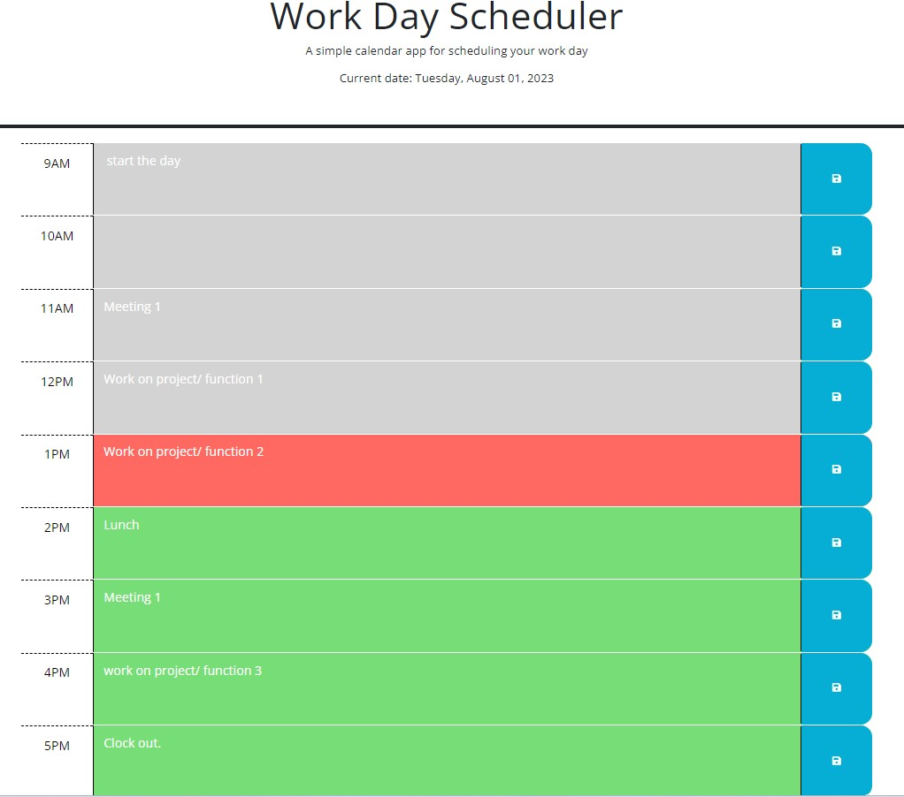

# my-work-planner-3000

### Description

- The reason for starting this project was to get some practical application experience with the dayjs() extension. Since this is planner type of app, there were plenty of chances to practice using this function. The most notable example was when we had to compare the past, present, and future classes time with the current time. The outcome of these comparisons would gve us the the background color of the input boxes depending on the time.

### Usage

- The usage is fairly simple. When you load the page, the planner is working in the background to render the current date and time slots.
- These boxes are for you to enter your planned events and there is a save button to save the data internally. This keeps if from disapering when the pages is refreshed.
- As the day goes on, you will see that the block background change in color from grey, orange, and green to represent past, present, and future time.
-

### Screenshots

### Links

- GitHub link: https://github.com/Sal1316/my-work-planner-3000

- Deployed site: https://sal1316.github.io/my-work-planner-3000
